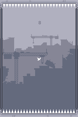

#  Flappybalt

A cross-platform port of @AdamAtomic's [Flappybalt](http://adamatomic.com/flappybalt/), converted to [Haxe](http://www.haxe.org) and [HaxeFlixel](http://www.haxeflixel.com).

All of the code in this repository is available under an MIT license. Code not included in this repository (mostly just app settings, private keys, etc) is copyright @SteveRichey but if you have questions about implementation let me know and I'll help you out!

### Changes:
* Pixel-perfect collisions.
* Special FX

Canabalt-themed flappy-like for [FlappyJam](http://itch.io/jam/flappyjam).

The original version was programmed in ActionScript 3, and required [flixel](http://flixel.org/) to compile.